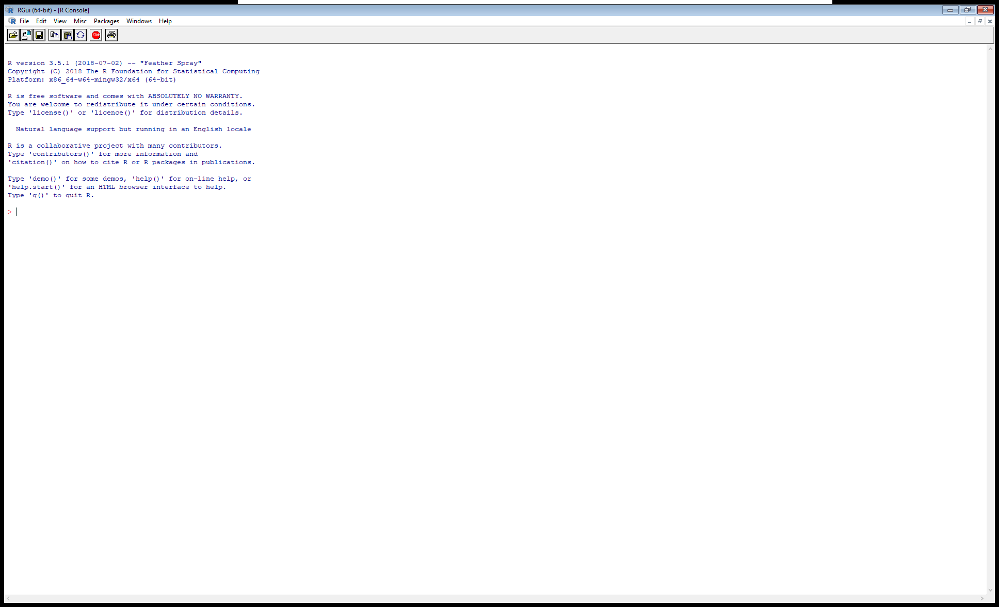
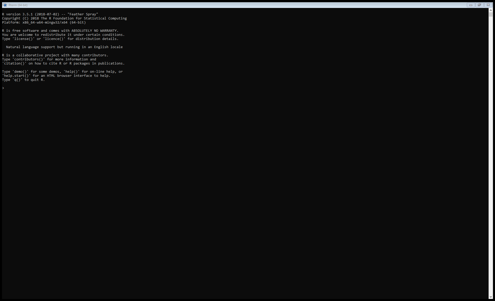
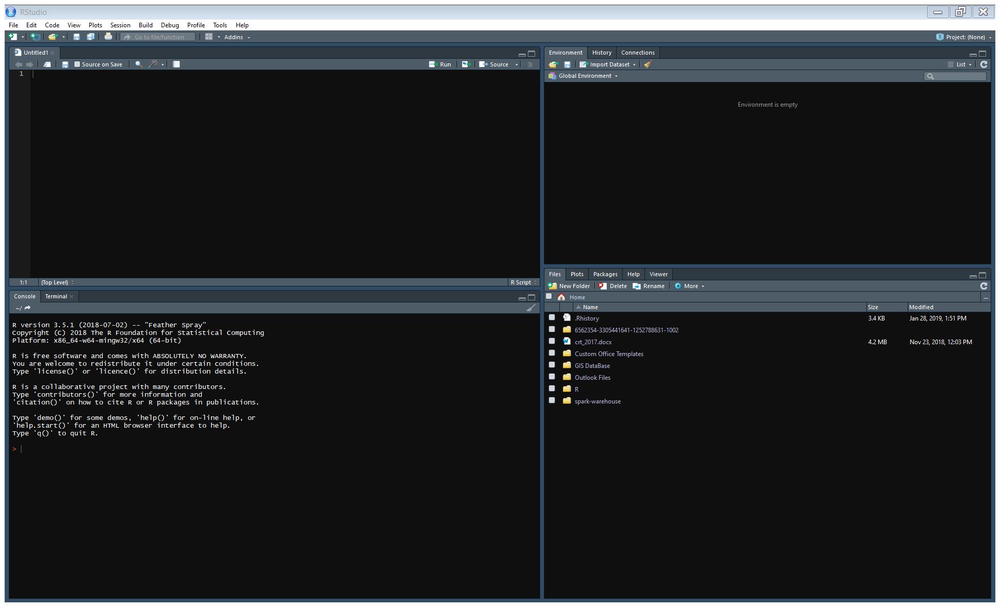

```{r setup, include=FALSE}
knitr::opts_chunk$set(warning=FALSE, message=FALSE, echo = FALSE)

######################################################################################################
### TIME ZONE
######################################################################################################
Sys.setenv(TZ="Africa/Bamako") # vérifer

##########################################################################
########################################/// PACKAGES ///
##########################################################################
# Packages (s'assurer que ces packages sont installées avant l'exécution du code)
library(knitr)

```

# Définir la *data science*

## Commençons par quelques exemples

Fait de la *data science*:

- l'économiste qui examine le niveau du PIB sur 30 ans et cherche à dégager des scénarii pour des futures évolutions

- le sociologue qui s'appuie le taux de natalité et le taux de participation des femmes au marché du travail pour comprendre l'évolution de la place de la femme dans la société

- le météorologue qui cherche à prédire la pluviométrie de la semaine à venir en modélisant les données historiques

- l'épidémiologue qui cartographie le taux de prévalence du paludisme pour appuiyer un programme stratégique

- ...

Tout ça, pour dire que la *data science* est une discipline transversale.
Elle se pratique dans plusieurs domaines.


## Une discipline carrefour


Selon [\textcolor{blue}{Wikipédia}](https://en.wikipedia.org/wiki/Data_science), la *data science* est un champ interdisciplinaire qui utilise les méthode, processus, algorithmes et systèmes scientifiques pour extraire des données - tant structurées que non structurées - des informations utiles à la compréhension et à la prise de décision.
De ce fait, elle s'appuie sur diverses méthodes (mathématiques, statistiques, informatiques, etc.) pour tirer des données une compréhension meilleure de phénomènes d'intérêt.

## Le *data scientist*, le métier du 21eme siècle

Face à la génération massive des données, dans tous les secteurs, le besoin de *data scientist* se fait pressant.

Qu'est-ce qu'un *data scientist*?
Quelqu'un qui pratique la *data science*, évidemment!
Mais plus que ça, c'est un détective des données, quelqu'un qui investigue les données en vue de découvrir des récurrences, de reveler des éléments surprenants ou tout simplement de prendre la mesure des faits déjà connus...et tout ça dans le dessein de guider la prise de décision.

Comme tout bon détective, il se doit de posseder ou de cultiver un certains nombres de compétences.
Quelles sont celles-ci?

## Ce qu'il faut pour être *data scientist*

- Pas nécéssairement un diplôme avancé en mathématiques ou en statistiques...quoiqu'il est utile de maîtriser des concepts de bases (vecteur, matrice, moyenne, écart-type, etc.)

- Pas forcément un diplôme en informatique ou en programmation...quoiqu'il est utile de connaître les notions de bases (qu'est-ce qu'un objet, un environnement? quels types d'objets peut-on manipuler dans un environnement donnée...)

- Une connaissance avérée dans un domaine spécifique dans lequel l'on peut soulever des questions, mobiliser des outils théoriques auxquels on confronte les résultats de l'analyse conduite sur les données

- Un esprit curieux, quelle que soit l'avenue que l'on emprunte.

Vous pourrez avoir une meilleure idée en surfant sur le net.
Pour commencer, regardez [\textcolor{blue}{ici}](https://www.lebigdata.fr/13-competences-necessaires-devenir-data-scientist).


# R

## Qu'est-ce que c'est que R?

[\textcolor{blue}{R}](http://r-project.org) est un langage de programmation et un logiciel gratuit et libre.
Il est surtout utilisé pour le développement de programmes statistiques et des analyses de données.
Il gagne en popularité depuis quelques années avec l'émergence de la *data science* et du fait qu'il est gratuit et ouvert (*open-source*).

R est née d'un projet de recherche mené par deux chercheurs, Ross Ihaka et Robert Gentleman à l'université d'Auckland (Nouvelle-Zélande) en 1993.
En 1997 est mis en place le *Comprehension R Archive Network (CRAN)* qui centralise les contributions au projet.
Depuis le projet connaît une croissance soutenue, grâce à des contributions de la part de milliers de personnes à travers le monde.

## Pourquoi R?

Pour un apprenti *data scientist*, le choix du langage et/ou du programme est une décision critique.
Considérant le temps qu'il investira en apprentissage et le retour qu'il espéra à travers l'utilisation de ses nouvelles connaissances dans sa profession, il est utile de considerer divers critères dont:

- l'accessibilité de l'outil en termes de coûts (tout n'est pas gratuit comme R!);

- l'accessibilité du langage en termes de syntaxe;

- la popularité du langage parmi les paires (en vue de faciliter des collaborations);

- la dynamique de développement du langage.

Et sur tous ces points, R présente des avantages.


## R dans l'écosystème des langages: TIOBE Index (1)

```{r, warning=FALSE, message=FALSE, out.width='100%', out.height='90%'}
library(readxl)
library(tidyverse)

tiobe_index <- read_excel("tiobe_index.xlsx")

tiobe_index %>% 
  ggplot(mapping = aes(x = janv_2018, y = janv_2019)) + 
  geom_abline(mapping = aes(intercept = 0, slope = 1), color = "yellow") +
  geom_text(mapping = aes(label = `Programming Language`), size = 3)  +
  labs(x = "Classement en janvier 2018", y = "Classement en janvier 2019",
       caption = paste("Source: Données tirées de https://www.tiobe.com/tiobe-index/"),
       title = paste("TIOBE Index"),
       subtitle = paste("Classement des langages sur la base de divers moteurs, janvier 2019") )

```

## R dans l'écosystème des langages: TIOBE Index (2)

```{r, warning=FALSE, message=FALSE, out.width='100%', out.height='90%'}

indexR <- tiobe_index$janv_2019[tiobe_index$Language == "R"]

tiobe_index %>% 
  mutate(direction = ifelse(Variation >0, 1, 2),
         direction = factor(direction, levels = c(1, 2), labels = c("Hausse", "Baisse"), ordered = TRUE)) %>% 
  ggplot(mapping = aes(x = reorder(`Programming Language`, Ratings) , y = Ratings*100, fill = direction)) +
  geom_col() + 
  coord_flip() +
  labs(x = "", y = "Part en janvier 2019 (%)", fill = "Variation",
       caption = paste("Source: Données tirées de https://www.tiobe.com/tiobe-index/"),
       title = paste("TIOBE Index"),
       subtitle = paste("Classement des langages sur la base de divers moteurs de recherche, janvier 2019") )

```


## R dans l'écosystème des langages: PYPL Index (1)

```{r, warning=FALSE, message=FALSE, out.width='100%', out.height='90%'}

pypl_rank <- read_excel("pypl_rank.xlsx")

indexR <- pypl_rank$Rank[pypl_rank$Language == "R"]

pypl_rank %>% 
  mutate(languagetop10 = ifelse(Rank<=indexR, Language, NA),
         colorR = (Language == "R")) %>% 
  ggplot(data = ,
         mapping = aes(x = Share*100, y = Trend*100)) + 
  geom_text(mapping = aes(label = languagetop10), size = 3) + 
  labs(x = "Part (%)", y = "Tendance par rapport à l'année dernière (%)",
       caption = paste("Source: Données tirées de http://pypl.github.io/PYPL.html"),
       title = paste("PopularitY of Programming Language Index"),
       subtitle = paste("Classement des langages sur la base des recherches dans Google, janvier 2019") )


```

## R dans l'écosystème des langages: PYPL Index (2)

```{r}

pypl_rank %>% 
  mutate(direction = ifelse(Trend >0, 1, 2),
         direction = factor(direction, levels = c(1, 2), labels = c("Hausse", "Baisse"), ordered = TRUE)) %>% 
  ggplot(mapping = aes(x = reorder(Language, Share) , y = Share*100, fill = direction)) +
  geom_col() + 
  coord_flip() +
  labs(x = "", y = "Part en janvier 2019 (%)", fill = "Variation",
       caption = paste("Source: Données tirées de http://pypl.github.io/PYPL.html"),
       title = paste("PopularitY of Programming Language Index"),
       subtitle = paste("Classement des langages sur la base des recherches dans Google, janvier 2019") )
```

## Télécharger R (1)

```{r, out.width='100%', out.height='90%'}
include_graphics("Rwebpage_home.png.png")
```

## Télécharger R (2)

```{r, out.width='100%', out.height='90%'}
include_graphics("Rwebpage_download.png.png")
```

## Un aperçu de R: *GUI*

```{r, out.width='100%', out.height='90%'}

```

## Un aperçu de R: Terminal

```{r, out.width='100%', out.height='90%'}

```


# RStudio

## Qu'est-ce que c'est que RStudio

- C'est une IDE (*Integrated Development Environment*) ou Environnement Intégré de Développement

- Il sert d'interface entre R et l'utilisateur, offre à celui diverses commodités d'utilisation

## Télécharger RStudio (1)

```{r, out.width='100%', out.height='90%'}

```

## Télécharger RStudio (2)

```{r, out.width='100%', out.height='90%'}
include_graphics("RStudio_download.png")
```

## Un aperçu de RStudio

```{r, out.width='100%', out.height='90%'}

```

## Et on démarre

Maintenant, vous avez les outils nécéssaires pour commencer la formidable aventuRe!


