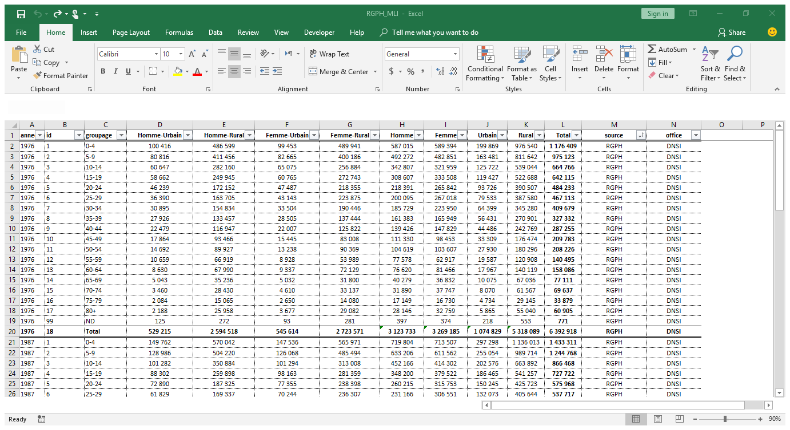

```{r setup, include=FALSE}
knitr::opts_chunk$set(warning=FALSE, message=FALSE, echo = FALSE) # , dev = "cairo_pdf"
#sansfont: Aller Light

######################################################################################################
### ENV
######################################################################################################
#x <- Sys.getenv("PATH")
#y <- paste(x, "E:\\miktex\\miktex\\bin", sep=";")
#Sys.setenv(PATH = y)

######################################################################################################
### TIME ZONE
######################################################################################################
Sys.setenv(TZ="Africa/Bamako") # vérifer


##########################################################################
########################################/// PACKAGES ///
##########################################################################
# Packages (s'assurer que ces packages sont install?es avant l'ex?cution du code)
#library("tidyverse")
#library("RODBC")
#library("modelr")
#library("lubridate")
#library("gridExtra")
#library("extrafont")
#library("broom")
#library("ggthemes")
#library("gganimate")
#library("cowplot")
#library("reshape2")
#library("readxl")
#library("RColorBrewer")
#library("plm")
#library("scales")
#library("xts")

```

# Introduction

## Objectif de ce cours

Dans le flux de travail (*workflow*) du _data scientist_, l'importation constitue très généralement le point de départ.
Les données ne sont toujours disponibles sous le format qui se prête à l'analyse souhaitée.
Elles peuvent exister dans un classeur Excel sous format _xls_, _xlsx_ ou _csv_.
Elles peuvent aussi se trouver dans une base de données relationnelles, où diverses tables sont connectées entres elles.
Elles peuvent même être disponibles sur Internet (page Wikipédia, Twitter, Facebook, etc.)
Dans tous les cas, il revient au _data scientist_ de connaitre la techique appropriée pour les importer dans son environnement de travail, les organiser et les analyser selon l'objectif qu'il s'assigne.

Dans ce cours, nous allons voir quelques techniques d'importation de données dans R.


## Que nous faut-il?

- R (évidemment) et RStudio (de préférence) installés sur le poste de travail

- les fichiers fournis dans le cadre du module

- un connexion Internet pour illustrer les exemples d'importation depuis la toile

## Aperçu

Nous allons illustrer ce chapitre avec une compilation de données tirées des [Recensements Généraux de la Population et de l'Habitat au Mali, menés respectivement en 1976, 1987, 1998 et 2009](https://www.malikunnafoni.com).
En voici un aperçu depuis Excel:

```{r ch1_pix1 , echo=FALSE, out.width = '90%'}



```

## Avant de commencer

Notre fichier se nomme: *"RGPH_MLI"*.
Nous allons l'ouvrir à partir de différent formats, qui seront traduits par diverses extensions (.csv, .txt, .xls, .xlsx, etc).

Avant d'ouvrir ces variantes, assurons-nous d'abord que le fichier est bien présent dans notre espace de travail (*working directory*):

```{r echo=c(-1, -3)}
knitr::asis_output("\\footnotesize")
dir(pattern = "data/RGPH_MLI.csv") 
knitr::asis_output("\\normalsize")
```

Le résultat indique que le fichier est présent dans l'espace de travail.
Maintenant, ouvrons-le!


# Fichiers plats: cas du format *CSV* 

## Aperçu

Comme son nom l'indique, le format *CSV* (*Comma Separated Values*) est un format où les valeurs de données rectangulaires sont séparées par une virgule (",").
Cette règle de base est commode pour les anglophones pour lesquels, les décimales viennent après un point (".") et non après une virgule.
Par contre, pour les francophones, le format de sauvegarde de données réquiert une règle différente.
Pour ne pas confondre le séparateur de valeurs et la virgule de la décimale, l'on utilise le point-virgule (";").
Nous verrons les fonctions qui conviennent pour chacun de ces deux formats.


## Importation avec _R-base_: read.csv

La version d'installation de R, couramment appelée R-base (ou base-R), vient avec un ensemble de fonctions qui sont disponibles par défaut.
Parmi celles-ci: "read.csv".
L'importation d'un fichier *csv* avec _R-base_ se fait de la façon suivante:

```{r echo=c(-1, -3)}
knitr::asis_output("\\tiny")
RGPH_MLI <- read.csv(
  file = "data/RGPH_MLI.csv", # spécifier le nom du fichier
  header = TRUE, # déclarer la première ligne comme nom de colonne/variable
  sep = ",", # déclarer la virgule comme séparateur
  stringsAsFactors = TRUE # voir cours sur les types de données dans R
  )
knitr::asis_output("\\normalsize")
```


Les éléments à l'intérieur de la fonction (*file*, *header*, *sep*, *stringsAsFactors*, *etc.*) sont les arguments de la fonction.
Celles-ci ont des valeurs défaut, qui peuvent toutefois être altérer par l'utilisateur.
Pour voir ces valeurs par défaut, consulter la documentation intégrer à R en entrant:

```{r echo=c(-1, -3), eval=-2}
knitr::asis_output("\\tiny")
?read.csv
knitr::asis_output("\\normalsize")
```

## Importation avec _R-base_: read.csv2

Avec read.csv déjà, le séparateur peut être spécifié pour permettre la prise en charge des fichiers qui ont point-virgule comme séparateur (";").
Toutefois, il existe une fonction bâtie au dessus de celle-ci, qui prend en charge les spécificités de ces fichiers.
Il s'agit de read.cvs2.

```{r echo=c(-1, -3)}
knitr::asis_output("\\tiny")
RGPH_MLI2 <- read.csv2(
  file = "data/RGPH_MLI2.csv", # spécifier le nom du fichier
  header = TRUE, # déclarer la première ligne comme nom de colonne/variable
  sep = ";", # déclarer la virgule comme séparateur
  stringsAsFactors = TRUE # voir cours sur les types de données dans R
  )
knitr::asis_output("\\normalsize")
```

Ici aussi, les valeurs par défaut des arguments sont maintenus.
Pour en savoir plus sur read.csv2, explorer la documentation R en tapant:

```{r echo=c(-1, -3), eval=-2}
knitr::asis_output("\\tiny")
?read.csv2
knitr::asis_output("\\normalsize")
```


## Importation avec *readr*: aperçu

[*readr*](https://readr.tidyverse.org/) est un package créé par [Hadley Wickham](http://hadley.nz/).
Ses fonctions sont similaires à *read.csv* et *read.csv2*.
*readr* présente l'avantage de faire partie du [*tidyverse*](https://www.tidyverse.org/).
Il travaille harmonieusement avec les autres packages de cet écosystème.
Sa syntaxe est très simple: pour importer un fichier csv, on utilise *read_csv* au lieu de *read.csv*.
Cette logique est valable pour d'autres formats, dont il suffit seulement d'ajouter l'extension après le tiret d'en bas ("_").
Ainsi, on a :

- *read_csv2*: pour les fichiers *CSV* ayant le point-virgule (";") comme séparateur

- *read_tsv*: pour les fichiers avec les valeurs séparées par des tabulations

- *read_fwf*: pour les fichiers avec les valeurs séparées par des espaces fixes


## Importation avec *readr*: *read_csv* et *read_csv2* 

Ouvrons le fichier csv avec *read_csv*

```{r echo=c(-1, -4)}
knitr::asis_output("\\tiny")
library(readr) # chargement du package "readr"
RGPH_MLI <- read_csv(  
  file = "data/RGPH_MLI.csv", # spécifier le nom du fichier
  col_names = TRUE, # déclarer la première ligne comme nom de colonne/variable
  na = "", # indiquer la valeur a attribuer aux cellules vides 
  skip = 0 # nombre de lignes à ne pas importer, partant du ficher
  )
knitr::asis_output("\\normalsize")
```

et *read_csv2*
```{r echo=c(-1, -4)}
knitr::asis_output("\\tiny")
library(readr) # chargement du package "readr"
RGPH_MLI2 <- read_csv2(  
  file = "data/RGPH_MLI2.csv", # spécifier le nom du fichier
  col_names = TRUE, # déclarer la première ligne comme nom de colonne/variable
  na = "", # indiquer la valeur a attribuer aux cellules vides 
  skip = 0 # nombre de lignes à ne pas importer, partant du ficher
  )
knitr::asis_output("\\normalsize")
```


## Importation avec *readr*: généralisation

*read_csv* est un cas spécifique d'une fonction généraliste qui couvrent un large spectre de formats : *read_delim*.

```{r echo=c(-1, -5)}
knitr::asis_output("\\tiny")
library(readr) # chargement du package "readr"
RGPH_MLI <- read_delim(
  file = "data/RGPH_MLI.csv", # spécifier le nom du fichier
  delim = "," # indiquer le séparateur
  )
RGPH_MLI2 <- read_delim(
  file = "data/RGPH_MLI2.csv", # spécifier le nom du fichier
  delim = ";" # indiquer le séparateur
  )
knitr::asis_output("\\normalsize")
```

Avec *read_delim*, divers format de fichiers peuvent être importés, à partir du moment où le séparateur est bien spécifié: virgule (","), point-virgule (";"), tabulation ("\t"), barre verticale ("|"), espace (" "), etc.
Les autres arguments peuvent être ajustés pour prendre en compte les spécificités des données.
Toutefois, il faut noter que *read_delim* est assez intuitive pour détecter le type des données (entiers, réels, caractères, etc.).
Elle inspecte jusqu'à 1000 lignes (et peut aller jusqu'à la nième ligne) pour déterminer le type de données d'une colonne.


# Excel: *xls*, *xlsx*

## Aperçu

Faisant partie de la suite MS Office, Excel est l'un des tableurs les plus populaires.
Il est difficile de l'exclure du _workflow_ du _data scientist_ car c'est l'outil de prédilection d'organisation et de sauvegarde des données dans beaucoup de domaines et secteurs (entreprises, administrations).
Les _data scientist_ opérant exclusivement sur des bases de données constituent une niche.
Pour la majorité, amenée à interagir avec des spécialistes d'autres domaines, il est important de pourvoir disposer de techniques pour importer les données collectées et organisées par leurs soins dans Excel.

Dans R, diverses solutions existent. 
Nous verrons deux packages: [*xlsx*](https://github.com/dragua/xlsx) et [*readxl*](https://readxl.tidyverse.org/).

## Importation avec *xlsx*: *read.xlsx*

Le package *xlsx* offre deux fonctions majeures pour lire des formats *xls* et *xlsx*. 
Il s'agit de *read.xlsx* et *read.xlsx2* (plus rapide sur les fichiers lourds).

```{r echo=c(-1, -7)}
knitr::asis_output("\\tiny")
library(xlsx) # chargement du package "xlsx"
# Exemple avec fichier Excel 97-2003
RGPH_MLI_xls <- read.xlsx( 
  file = "data/RGPH_MLI.xls", # spécifier le nom du fichier (format "xls")
  sheetIndex = 1, # indiquer le numéro d'ordre de l'onglet à importer
#  sheetName = "RGPH_MLI" # indiquer le nom de l'onglet (alternative au numéro d'ordre)
  header = TRUE # déclarer la première ligne comme nom de colonne/variable
  )
# Exemple avec fichier Excel 2007-plus
RGPH_MLI_xlsx <- read.xlsx( 
  file = "data/RGPH_MLI.xlsx", # spécifier le nom du fichier  (format "xlsx")
  sheetIndex = 1, # indiquer le numéro d'ordre de l'onglet à importer
#  sheetName = "RGPH_MLI" # indiquer le nom de l'onglet (alternative au numéro d'ordre)
  header = TRUE # déclarer la première ligne comme nom de colonne/variable
  )
knitr::asis_output("\\normalsize")
```


## Importation avec *readxl*: *read_excel*

Le package *readxl* est bâti sur les mêmes principes que *readr* [[voir](https://www.tidyverse.org/)].
Il permet d'importer des formats Excel avec la même logique syntaxique.
Il contient des fonctions spécifiques, *read_xls* et *read_xlsx*, et une fonction généraliste, *read_excel*


```{r echo=c(-1, -7)}
knitr::asis_output("\\tiny")
library(readxl) # chargement du package "readxl"
# Exemple avec fichier Excel 97-2003
RGPH_MLI_xls <- read_excel(
  path = "data/RGPH_MLI.xls", # spécifier le nom du fichier (format "xls")
  sheet = "RGPH_MLI", # indiquer le nom de l'onglet ou le numéro d'ordre, les deux sont acceptés
  col_names = TRUE)
# Exemple avec fichier Excel 2007-plus
RGPH_MLI_xlsx <- read_excel(
  path = "data/RGPH_MLI.xlsx", # spécifier le nom du fichier (format "xls")
  sheet = "RGPH_MLI", # indiquer le nom de l'onglet ou le numéro d'ordre, les deux sont acceptés
  col_names = TRUE)
knitr::asis_output("\\normalsize")
```


# Formats issues d'autres logiciels statistiques: Stata et SPSS

## Aperçu

Le data scientist peut aussi être amené à travailler sur des données sauvegardées à partir d'autres programmes de traitement de données tels que Stata, SPSS, SAS, etc.
Dans R, les solutions sont nombreuses.
Ici, nous allons voir deux packages: *foreign* et *haven*.


## Importation avec *foreign*

Le package [*foreign*](https://cran.r-project.org/web/packages/foreign/index.html) permet d'ouvrir des fichiers *dta*, issus de Stata...

```{r echo=c(-1, -4)}
knitr::asis_output("\\tiny")
library(foreign) # chargement du package "foreign"
RGPH_MLI_stata <- read.dta(
  file = "data/RGPH_MLI.dta", # spécifier le nom du fichier
  convert.dates = TRUE, # conversion des dates du format Stata au format R (pour dire simple)
  convert.factors = TRUE, # conversion des étiquettes de variables catégorielles en facteurs
  convert.underscore = FALSE, # convertir "_" de Stata en "." dans R (surtout nom des variables)
  missing.type = FALSE, # donner ou pas une valeur particulière aux cellules vides?
  warn.missing.labels = TRUE # si oui, cet argument indique si cette valeur est présente ou pas
    )
knitr::asis_output("\\normalsize")
```

et des fichiers *sav*, issus de SPSS

```{r echo=c(-1, -4)}
knitr::asis_output("\\tiny")
library(foreign) # chargement du package "foreign"
RGPH_MLI_spss <- read.spss(
  file = "data/RGPH_MLI.sav", # spécifier le nom du fichier
  use.value.labels = TRUE, # conservation des étiquettes de variables catégorielles
  to.data.frame = TRUE # importation en data frame au lieu de matrice
  )
knitr::asis_output("\\normalsize")
```


# Base de données relationnelles

## Aperçu

R peut aussi importer des données depuis une base de données relationnelles.
Celle-ci peut aussi bien être locale, installée sur le poste de travail, que distante, installée sur un serveur accessible via Internet.
Nous allons illustrer ici avec une base locale.

Les packages varient d'un type de base à un autre: 

- *RMySQL* pour MySQL, 

- *RPostgreSQL* pour PostgreSQL

- *RSQLite*: pour SQLite

- etc.

Pour plus de détails, consulter cette [page](https://db.rstudio.com/getting-started/).


## Importation avec *RODBC*

Commençons par ouvrir le chaine de communication entre R et la base via ODBC (*Open Data Base Connectivity*).

```{r echo=c(-1, -4)}
knitr::asis_output("\\tiny")
library(RODBC) # chargement du package "RODBC"
dswr <- odbcConnect(
  dsn = "dswr", # indiquer le nom de la chaîne de connection 
  uid = "", # indiquer l'identifiant (s'il y'en a)
  pwd = "" # indiquer le mot de passe (s'il y'en a)
  ) 
knitr::asis_output("\\normalsize")
```

Maintenant, importons la table qui nous intéresse, *RGPH_MLI*. Pour celà, deux méthodes sont possibles:
```{r echo=c(-1, -6)}
knitr::asis_output("\\tiny")
# Méthode 1: extraction de la table
RGPH_MLI_rodbc_tbl <- sqlFetch(
  dswr, # indiquer le nom de la chaîne de connection
  sqtable = "RGPH_MLI" # indiquer le nom de la table
  ) 
# Méthode 2: requête SQL
RGPH_MLI_rodbc_sql <- sqlQuery(
  channel = dswr, # indiquer le nom de la chaîne de connection
  query = "SELECT * FROM RGPH_MLI;" # selectionner toutes les colonnes et lignes de la table "RGPH_MLI"
  ) 
knitr::asis_output("\\normalsize")
```

Une fois les extractions de données finie, il faut penser à briser la chaîne de connection, fermer la porte.
```{r echo=c(-1, -3)}
knitr::asis_output("\\tiny")
odbcClose(dswr)
knitr::asis_output("\\normalsize")
```


## Importation avec *odbc*

Une autre solution est de passe par le package *odbc*.

```{r echo=c(-1, -5)}
knitr::asis_output("\\tiny")
library(odbc) # chargement du package "odbc"
library(DBI) # chargement du package "DBI"
dswr <- dbConnect(
  odbc::odbc(), # indiquer le package utilisé par l'interfacee "DBI"
  "dswr" #, indiquer le nom de la chaîne de connection
#  dbname = "",
#  host = "",
#  user = "",  # indiquer l'identifiant (s'il y'en a)
#  password = "" # indiquer le mot de passe (s'il y'en a)
  )
knitr::asis_output("\\normalsize")
```

Comme avant, on peut importer la table d'intérêt par deux méthodes

```{r echo=c(-1, -6)}
knitr::asis_output("\\tiny")
# Méthode 1: extraction de la table
RGPH_MLI_odbc <- dbReadTable(
  conn = dswr, # indiquer le nom de la chaîne de connection
  name = "RGPH_MLI" # indiquer le nom de la table indiquer
  ) 
# Méthode 2: requête SQL
RGPH_MLI_odbc_sql <- dbGetQuery(
  conn = dswr, # indiquer le nom de la chaîne de connection
  "SELECT * FROM RGPH_MLI;" # selectionner toutes les colonnes et lignes de la table "RGPH_MLI"
  ) 
knitr::asis_output("\\normalsize")
```

Comme avant, en bon invité, on ferme la porte en sortant...

```{r echo=c(-1, -3)}
knitr::asis_output("\\tiny")
dbDisconnect(dswr)
knitr::asis_output("\\normalsize")
```


# Depuis Internet

## Aperçu

Les données peuvent aussi être tirées de la toile mondiale.
Les outils disponibles dans R varient selon le type de données.

## Chargement de fichier CSV

Pour un fichier CSV, le chargement dans l'environnement R se fait de la même façon que pour des fichiers locaux.
```{r echo=c(-1, -4)}
knitr::asis_output("\\tiny")
url <- "https://github.com/fousseynoubah/dswr/blob/master/data/rgph_groupage/RGPH_MLI.csv"
RGPH_MLI_csv_online <- read.csv(url)
knitr::asis_output("\\normalsize")
```

## Chargement de fichier Excel

Pour le format Excel, la procédure est différente.
Les données ont besoin d'être téléchargées localement avant d'être chargées dans l'environement R.

```{r echo=c(-1, -4)}
knitr::asis_output("\\tiny")
url <- "https://github.com/fousseynoubah/dswr/blob/master/data/rgph_groupage/RGPH_MLI.xlsx?raw=true"
download.file(url = url, # adresse du fichier
              destfile = "data/RGPH_MLI_github.xlsx", # nom du fichier une fois téléchargé
              mode = "wb" # mode de téléchargement
              )
RGPH_MLI_xlsx_online <- read_excel(
  path = "data/RGPH_MLI_github.xlsx",
  sheet = 1)
knitr::asis_output("\\normalsize")
```


